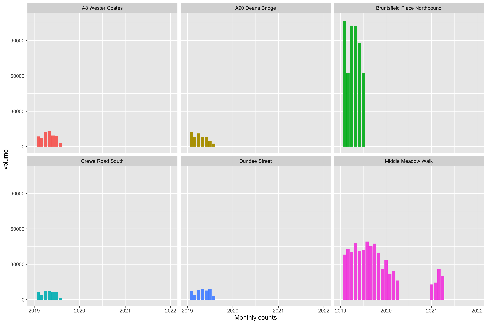

# spokes-cycle-counters

## Building database

There are dozens of folders with counter data. We first build a database so we can query counters of interest without loading the whole lot into R.

1. Download data from Google Drive.
2. Move count folders (each of which hold the csv files) into directory `/data`.
3. Run <a href="https://github.com/dplloyd/spokes-cycle-counters/blob/55ddaab99df60886f94d50eb72e193a8e629471c/spokes_build_database.R"  > spokes_build_database.R</a>. SQL database is written to `/data`.  **Note, current version only processes csv files where the file name starts with "bin". Needs updated.**
4. Do analysis. For example, run  <a href="https://github.com/dplloyd/spokes-cycle-counters/blob/55ddaab99df60886f94d50eb72e193a8e629471c/spokes-exploring-ECC-counter-data.Rmd">spokes-exploring-ECC-counter-data.Rmd </a>  to see how the data are read.

Rough first plots, with next to no data cleaning and checking. Still need to add "pvm" files

## Total monthly counts
Clipped to year >=2019

